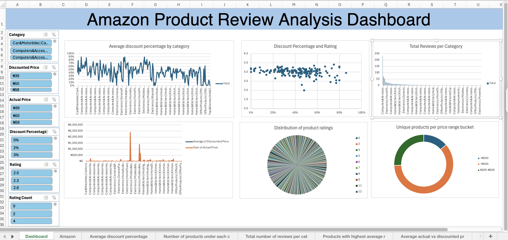

# Amazon E-commerce Case Study Dashboard (Excel)

## Project Overview
This project involves analyzing an Amazon product dataset to uncover key business insights using **Excel dashboards, pivot tables, and charts**. The goal was to derive actionable analytics across product categories, pricing, ratings, reviews, and discounts to support data-driven decision-making.

## Key Objectives
I answered 14 business questions using Excel:

1. What is the average discount percentage by product category?  
2. How many products are listed under each category?  
3. What is the total number of reviews per category?  
4. Which products have the highest average ratings?  
5. What is the average actual price vs the discounted price by category?  
6. Which products have the highest number of reviews?  
7. How many products have a discount of 50% or more?  
8. What is the distribution of product ratings (e.g., how many products are rated 3.0, 4.0, etc.)?  
9. What is the total potential revenue (actual price × rating_count) by category?  
10. What is the number of unique products per price range bucket (e.g., <₹200, ₹200–₹500, >₹500)?  
11. How does the rating relate to the level of discount?  
12. How many products have fewer than 1,000 reviews?  
13. Which categories have products with the highest discounts?  
14. Identify the top 5 products in terms of rating and number of reviews combined.  

## Dashboard Features
- Interactive **slicers** to filter by product category and price range  
- **Pivot charts** showing discount trends, reviews, pricing gaps, and ratings  
- **KPI indicators** for top-rated and most-reviewed products  
- **Conditional formatting** to highlight standout products  
- **Scatter plot** to show relationship between discount % and product ratings  

## Tools & Techniques Used
- Microsoft Excel  
- Pivot Tables & Charts  
- Data Cleaning & Transformation  
- Custom Metrics & Formulas  
- Slicers for interactivity  
- Dashboard Layout Design  

## Files Included
- `Amazon case study.xlsx` – Contains:
  - Raw data
  - Pivot tables for each question
  - Final interactive dashboard

## Key Takeaways
This project demonstrates my ability to:
- Analyze real-world e-commerce data
- Build visually engaging and functional dashboards in Excel
- Extract insights from discount, rating, and review metrics
- Communicate data-driven findings clearly and interactively

